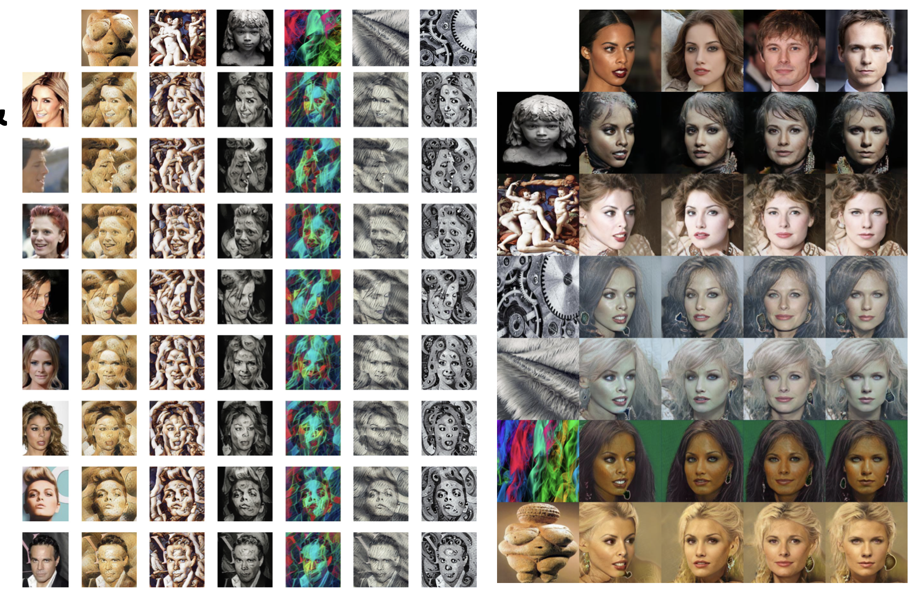

# Neural Style Transfer

BU CS 585 Final Project - Spring 2021 Bowen Sun, Hao He, Yinpei Su, Zimou Sun 25th April 2021

## 1.Introduction

Neural style transfer is an optimization technique used to take two images—a content image and a style reference image (such as an artwork by a famous painter)—and blend them together so the output image looks like the content image, but “painted” in the style of the style reference image. 

This is implemented by optimizing the output image to match the content statistics of the content image and the style statistics of the style reference image. These statistics are extracted from the images using a convolutional network.

## 2.Method

#### 2.1 Style Transfer for Arbitrary Styles

Artistic style transfer may be defined as creating a stylized image x from a content image c and a style image s. Typically, the content image c is a photograph and the style image s is a painting. A neural algorithm of artistic style posits the content and style of an image may be defined as follows:

- Two images are similar in content if their high-level features as extracted by an image recognition system are close in Euclidean distance.
-  Two images are similar in style if their low-level features as extracted by an image recognition system share the same spatial statistics.

The complete optimization objective for style transfer may be expressed as:

    

    

#### 2.2 StarGAN v2

Let X and Y be the sets of images and possible domains, respectively. Given an image x, and an arbitrary domain y, the goal is to train a single generatorGthat can generate diverse images of each domain y that corresponds to the image x. They generate domain-specific style vectors in the learned style space of each domain and train G to reflect the style vectors. 

There are four modules: **Generator**, **Mapping network**, **Style encoder**, **Discriminator**. 

**Adversarial objective.**

    

**Style reconstruction.**

    

**Style diversification.**

    

**Preserving source characteristics.**

 

**Full objective.**

 

#### 2.3 Re-train StarGAN v2 using CelebA and PBN
To test the model capability on our designed problem set, we re-train the StarGAN v2 using both celebrity
photos and stylish paintings. The domains are defined as Male, Female(from CelebA) and 40 genres(from PBN). We trained it for 100000 epoches for about 3 days.

**Training**
To start training on CelebA and PBN, firstly, run Prepare_dataset.ipynb to prepare dataset into two folders: ref and src(or any name you want). And then run the code below:
python main.py --mode train --num_domains 2 --w_hpf 1 \
               --lambda_reg 1 --lambda_sty 1 --lambda_ds 1 --lambda_cyc 1 \
               --train_img_dir [where you put the training set, e.g. 'data/celeba_hq/train'] \
               --val_img_dir [where you put the validation set, e.g. 'data/celeba_hq/val']

**Testing**
To test model or to generate costumed images, create your own testing source image folder with two folders: ref and src. Put source images (e.g. celebrity face photos) and refrence images (e.g. painting images from PBN) in each folders. 
Download the checkpoint file https://www.dropbox.com/s/96fmei6c93o8b8t/100000_nets_ema.ckpt?dl=0, and save it to expr/checkpoints/celeba_hq.
And run code below, the genreated images and videos will appear in the output folder you specify. The number of folders in both src and ref should be the same as the num_domains.
python main.py --mode sample --num_domains [the number of folders in src/ref] --resume_iter 100000 --w_hpf 1 \
               --result_dir [where you want to put your results, e.g. 'expr/results/celeba_hq'] \
               --src_dir [where you put your source images, e.g. 'assets/representative/celeba_hq/src'] \
               --ref_dir [where you put your reference images, e.g. 'assets/representative/celeba_hq/ref']

## 3.Data Collection

**CelebFaces Attributes Dataset (CelebA)** is a large-scale face attributes dataset with more than 200K celebrity images, each with 40 attribute annotations. We use these celebrity photos as content images. For Style Transfer for Arbitrary Styles, we use style images from tf-hub, and find some other style imagess from internet; for StarGanv2, we use the sample images of it as style images. After that, we also use our own images as content images to play with it.

**Painter by Number dataset(PBN)** is a dataset about paintings with various painters and styles. It has 103,251 imges with several attributes. In our problen set, we define 'genre' attribute to be the 'style' we want. This dataset contains 40 genres(styles), and we move paintings to differene folders with respect to their genres.

## 4.Results

#### 4.1 Style Transfer for Arbitrary Styles

We choose several distinct styles and collect celebrity images, applying each style to these celebrity photos.

 

#### 4.2 StarGANv2

We apply StarGAN to these celebrity images to transfer semantic attributes, synthesizing images that reflect diverse styles of references including hairstyle, makeup and beard.

 

## 5.Analysis

#### 5.1 Qualitative Metrics

For Style Transfer for Arbitrary Styles in 4.1, we found when the color change of style images is obvious, the the quality of the generated image is poor. Shown in the following figure, the columns of 3rd, 5th, 7th, the quality is relatively low. For other cases, the stylized images looks well.

 

For StarGANv2 in 4.2, we found when there are some obstructions on the face, the quality is poor. Or when the height and width of the picture are very different, the quality of the synthesized picture is very low. Shown in the following figure, the imges of 1st, 6th, 7th columns are not satisfying. When the face is properly proportioned, the algorithm works weill.

 

For the re-trained model, we generate transformed images with the same style images used in the first part. We compare the resultL

 

We can find that the StarGAN v2 can genreate clear face information and give us reasonable style transfer results. But it also have some drawbacks. It could mostly capture color information and will lose some obvious texture information. However, it can capture very minor textures.
The model also tend to transfer male to female images, this may because there are more female images than male images in training set, thus the model tends to obtain more feamale features.

#### 5.2 Quantitative Metrics

##### 5.2.1 Quantitative evalution for different styles

We randomly sampled 1000 images from 202,599 face images and measure the distance of feature representations between Stylized image and content image, and the between Stylized image and style image. Shown in the following figure, the loss of first two columns is higher than others, we think the drastic color changes cause the poor result.

 

##### 5.2.2 Quantitative evalution for different faces

We collected the losses on different faces, and find facess with top-5 loss, shown in the following figure. We think the colorful background affect the final results.

 

## 6. Reference

[1] Leon A. Gatys, Alexander S. Ecker, Matthias Bethge. A Neural Algorithm of Artistic Style.  [2] Golnaz Ghiasi, Honglak Lee, Manjunath Kudlur, Vincent Dumoulin, Jonathon Shlens. Exploring the structure of a real-time, arbitrary neural artistic stylization network. [3] Leon A. Gatys, Alexander S. Ecker, Matthias Bethge. Texture Synthesis Using Convolutional Neural Networks.  [4] Yunjey Choi, Youngjung Uh, Jaejun Yoo, Jung-Woo Ha. StarGAN v2: Diverse Image Synthesis for Multiple Domains. 
